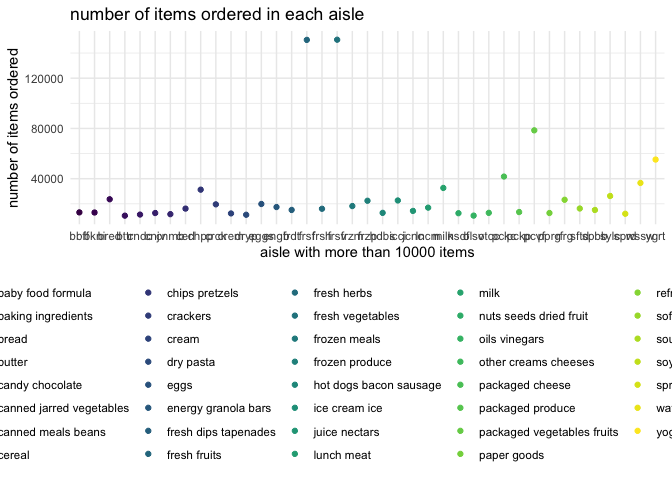

P8105\_hw3\_gc2942
================

## Problem 1

``` r
library(p8105.datasets)
data("instacart")
data("brfss_smart2010")
library(skimr)
```

1.  There are 134 aisles in the data set. Fresh vegetables aisle are the
    most items order from.

``` r
instacart %>% 
  janitor::clean_names() %>% 
  group_by(aisle_id) %>% 
  summarize(n_obs = n())
```

    ## # A tibble: 134 × 2
    ##    aisle_id n_obs
    ##       <int> <int>
    ##  1        1  2936
    ##  2        2  3873
    ##  3        3 17449
    ##  4        4  9917
    ##  5        5  2905
    ##  6        6  1795
    ##  7        7  1526
    ##  8        8  1501
    ##  9        9  9736
    ## 10       10   448
    ## # … with 124 more rows

``` r
instacart %>% 
  janitor::clean_names() %>% 
  group_by(aisle) %>% 
  summarize(frequency = n()) %>% 
  mutate(aisle_rank = min_rank(desc(frequency))) %>% 
  filter(aisle_rank == 1)
```

    ## # A tibble: 1 × 3
    ##   aisle            frequency aisle_rank
    ##   <chr>                <int>      <int>
    ## 1 fresh vegetables    150609          1

2.  Fresh fruit and fresh vegetables are the most popular aisles that
    people buy.

``` r
instacart %>% 
  group_by(aisle) %>% 
  summarize(frequency = n()) %>%
  filter(frequency > 10000)%>%
  arrange(frequency) %>% 
  ggplot(aes(x = abbreviate(aisle,4), y = frequency)) +
  geom_point(aes(color = aisle))+
  labs(title = "number of items ordered in each aisle",
       x = "aisle with more than 10000 items",
       y = "number of items ordered") +
  viridis::scale_color_viridis(
    name ="aisle",
    discrete = TRUE
  )
```



3.  The most popular items in baking ingredients are light brown
    sugar,pure baking sodaand cane sugar. The most popular items in dog
    food care are snack sticks chicken &rice recipe dag treats, organix
    chicken & brown rice recipe, and small dog biscuits. The most
    popualar items in packaged vegetable fruits are oganic baby spinach,
    organic raspberries, and organic blueberries.

``` r
instacart %>% 
  select(aisle_id,aisle,product_name) %>% 
  filter(aisle %in% c("baking ingredients", "dog food care", "packaged vegetables fruits")) %>% 
  group_by(aisle,product_name) %>% 
  summarize(number_of_times = n()) %>% 
  mutate(product_rank = min_rank(desc(number_of_times))) %>% 
  filter(product_rank %in% c(1,2,3)) %>% 
  arrange(aisle,product_rank) %>% 
  knitr::kable(digits = 0)
```

    ## `summarise()` has grouped output by 'aisle'. You can override using the `.groups` argument.

| aisle                      | product\_name                                 | number\_of\_times | product\_rank |
|:---------------------------|:----------------------------------------------|------------------:|--------------:|
| baking ingredients         | Light Brown Sugar                             |               499 |             1 |
| baking ingredients         | Pure Baking Soda                              |               387 |             2 |
| baking ingredients         | Cane Sugar                                    |               336 |             3 |
| dog food care              | Snack Sticks Chicken & Rice Recipe Dog Treats |                30 |             1 |
| dog food care              | Organix Chicken & Brown Rice Recipe           |                28 |             2 |
| dog food care              | Small Dog Biscuits                            |                26 |             3 |
| packaged vegetables fruits | Organic Baby Spinach                          |              9784 |             1 |
| packaged vegetables fruits | Organic Raspberries                           |              5546 |             2 |
| packaged vegetables fruits | Organic Blueberries                           |              4966 |             3 |

4.The mean hour of day for Coffee Ice Cream is highest in Tuesday.The
mean hour of day for Pink Lady Apples is highest in Wednesday.

``` r
instacart %>%   
  filter(product_name == c("Coffee Ice Cream","Pink Lady Apples"))%>%     
  group_by(product_name,order_dow) %>%  
  summarize(mean_hour = mean(order_hour_of_day)) %>%  
  mutate(order_dow = order_dow + 1) %>% 
  mutate(order_dow = lubridate::wday(order_dow, label = TRUE)) %>% 
  pivot_wider(
    names_from = order_dow,
    values_from = mean_hour
  ) %>% 
  knitr::kable(digits = 2)
```

    ## `summarise()` has grouped output by 'product_name'. You can override using the `.groups` argument.

| product\_name    |   Sun |   Mon |   Tue |   Wed |   Thu |   Fri |   Sat |
|:-----------------|------:|------:|------:|------:|------:|------:|------:|
| Coffee Ice Cream | 14.54 | 13.14 | 15.42 | 15.25 | 15.27 | 14.00 | 15.16 |
| Pink Lady Apples | 14.50 | 10.95 | 11.36 | 14.56 | 11.33 | 11.89 | 12.43 |

There are 1384617 and 15 in the instacart data. The structure of data is
shown by `str(instacart)` and gives us a preview of each column. The key
variables are order\_id, product\_id, add\_to\_cart\_order, reordered,
user\_id, eval\_set, order\_number, order\_dow, order\_hour\_of\_day,
days\_since\_prior\_order, product\_name, aisle\_id, department\_id,
aisle, department. If we want some observations of data set, we can look
at Table: Data summary

|                                                  |           |
|:-------------------------------------------------|:----------|
| Name                                             | instacart |
| Number of rows                                   | 1384617   |
| Number of columns                                | 15        |
| \_\_\_\_\_\_\_\_\_\_\_\_\_\_\_\_\_\_\_\_\_\_\_   |           |
| Column type frequency:                           |           |
| character                                        | 4         |
| numeric                                          | 11        |
| \_\_\_\_\_\_\_\_\_\_\_\_\_\_\_\_\_\_\_\_\_\_\_\_ |           |
| Group variables                                  | None      |

**Variable type: character**

| skim\_variable | n\_missing | complete\_rate | min | max | empty | n\_unique | whitespace |
|:---------------|-----------:|---------------:|----:|----:|------:|----------:|-----------:|
| eval\_set      |          0 |              1 |   5 |   5 |     0 |         1 |          0 |
| product\_name  |          0 |              1 |   3 | 159 |     0 |     39123 |          0 |
| aisle          |          0 |              1 |   3 |  29 |     0 |       134 |          0 |
| department     |          0 |              1 |   4 |  15 |     0 |        21 |          0 |

**Variable type: numeric**

| skim\_variable            | n\_missing | complete\_rate |       mean |        sd |  p0 |    p25 |     p50 |     p75 |    p100 | hist  |
|:--------------------------|-----------:|---------------:|-----------:|----------:|----:|-------:|--------:|--------:|--------:|:------|
| order\_id                 |          0 |              1 | 1706297.62 | 989732.65 |   1 | 843370 | 1701880 | 2568023 | 3421070 | ▇▇▇▇▇ |
| product\_id               |          0 |              1 |   25556.24 |  14121.27 |   1 |  13380 |   25298 |   37940 |   49688 | ▆▆▇▆▇ |
| add\_to\_cart\_order      |          0 |              1 |       8.76 |      7.42 |   1 |      3 |       7 |      12 |      80 | ▇▁▁▁▁ |
| reordered                 |          0 |              1 |       0.60 |      0.49 |   0 |      0 |       1 |       1 |       1 | ▆▁▁▁▇ |
| user\_id                  |          0 |              1 |  103112.78 |  59487.15 |   1 |  51732 |  102933 |  154959 |  206209 | ▇▇▇▇▇ |
| order\_number             |          0 |              1 |      17.09 |     16.61 |   4 |      6 |      11 |      21 |     100 | ▇▂▁▁▁ |
| order\_dow                |          0 |              1 |       2.70 |      2.17 |   0 |      1 |       3 |       5 |       6 | ▇▂▂▂▆ |
| order\_hour\_of\_day      |          0 |              1 |      13.58 |      4.24 |   0 |     10 |      14 |      17 |      23 | ▁▃▇▇▃ |
| days\_since\_prior\_order |          0 |              1 |      17.07 |     10.43 |   0 |      7 |      15 |      30 |      30 | ▅▅▃▂▇ |
| aisle\_id                 |          0 |              1 |      71.30 |     38.10 |   1 |     31 |      83 |     107 |     134 | ▆▃▃▇▆ |
| department\_id            |          0 |              1 |       9.84 |      6.29 |   1 |      4 |       8 |      16 |      21 | ▇▂▂▅▂ |

.

## Problem 2

``` r
brfss_smart2010 %>% 
  janitor::clean_names() %>%  
  filter(topic =="Overall Health") %>%  
  select(topic,response) %>% 
  mutate(response = forcats::fct_relevel (response, "Poor", "Fair","Good","Very good","Excellent")) %>% 
  arrange(response)
```

    ## # A tibble: 10,625 × 2
    ##    topic          response
    ##    <chr>          <fct>   
    ##  1 Overall Health Poor    
    ##  2 Overall Health Poor    
    ##  3 Overall Health Poor    
    ##  4 Overall Health Poor    
    ##  5 Overall Health Poor    
    ##  6 Overall Health Poor    
    ##  7 Overall Health Poor    
    ##  8 Overall Health Poor    
    ##  9 Overall Health Poor    
    ## 10 Overall Health Poor    
    ## # … with 10,615 more rows

``` r
brfss_smart2010 %>% 
  janitor::clean_names() %>% 
  select(year,locationabbr,locationdesc) %>% 
  filter(year == c(2002,2010)) %>% 
  group_by(year,locationabbr)
```

    ## # A tibble: 14,106 × 3
    ## # Groups:   year, locationabbr [98]
    ##     year locationabbr locationdesc         
    ##    <int> <chr>        <chr>                
    ##  1  2010 AL           AL - Jefferson County
    ##  2  2010 AL           AL - Jefferson County
    ##  3  2010 AL           AL - Jefferson County
    ##  4  2010 AL           AL - Jefferson County
    ##  5  2010 AL           AL - Jefferson County
    ##  6  2010 AL           AL - Jefferson County
    ##  7  2010 AL           AL - Jefferson County
    ##  8  2010 AL           AL - Jefferson County
    ##  9  2010 AL           AL - Jefferson County
    ## 10  2010 AL           AL - Jefferson County
    ## # … with 14,096 more rows
