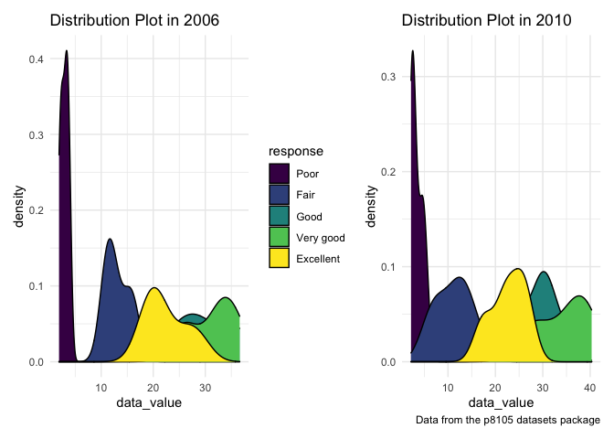

P8105\_hw3\_gc2942
================

## Problem 1

``` r
library(p8105.datasets)
data("instacart")
data("brfss_smart2010")
library(skimr)
```

1.  There are 134 aisles in the data set. Fresh vegetables aisle are the
    most items order from.

``` r
instacart %>% 
  janitor::clean_names() %>% 
  group_by(aisle_id) %>% 
  summarize(n_obs = n())
```

    ## # A tibble: 134 × 2
    ##    aisle_id n_obs
    ##       <int> <int>
    ##  1        1  2936
    ##  2        2  3873
    ##  3        3 17449
    ##  4        4  9917
    ##  5        5  2905
    ##  6        6  1795
    ##  7        7  1526
    ##  8        8  1501
    ##  9        9  9736
    ## 10       10   448
    ## # … with 124 more rows

``` r
instacart %>% 
  janitor::clean_names() %>% 
  group_by(aisle) %>% 
  summarize(frequency = n()) %>% 
  mutate(aisle_rank = min_rank(desc(frequency))) %>% 
  filter(aisle_rank == 1)
```

    ## # A tibble: 1 × 3
    ##   aisle            frequency aisle_rank
    ##   <chr>                <int>      <int>
    ## 1 fresh vegetables    150609          1

2.  Fresh fruit and fresh vegetables are the most popular aisles that
    people buy.

``` r
instacart %>% 
  group_by(aisle) %>% 
  summarize(frequency = n()) %>%
  filter(frequency > 10000)%>%
  arrange(frequency) %>% 
  ggplot(aes(x = aisle, y = frequency)) +
  geom_point(aes(color = aisle))+
  geom_blank()+
  labs(title = "number of items ordered in each aisle",
       x = "aisle with more than 10000 items",
       y = "number of items ordered") +
  viridis::scale_color_viridis(
    name ="aisle",
    discrete = TRUE
  ) +
  scale_x_discrete(label = abbreviate)
```

<!-- -->

3.  The most popular items in baking ingredients are light brown
    sugar,pure baking soda and cane sugar. The most popular items in dog
    food care are snack sticks chicken &rice recipe dag treats, organix
    chicken & brown rice recipe, and small dog biscuits. The most
    popualar items in packaged vegetable fruits are oganic baby spinach,
    organic raspberries, and organic blueberries.

``` r
instacart %>% 
  select(aisle_id,aisle,product_name) %>% 
  filter(aisle %in% c("baking ingredients", "dog food care", "packaged vegetables fruits")) %>% 
  group_by(aisle,product_name) %>% 
  summarize(number_of_times = n()) %>% 
  mutate(product_rank = min_rank(desc(number_of_times))) %>% 
  filter(product_rank %in% c(1,2,3)) %>% 
  arrange(aisle,product_rank) %>% 
  knitr::kable(digits = 0)
```

    ## `summarise()` has grouped output by 'aisle'. You can override using the `.groups` argument.

| aisle                      | product\_name                                 | number\_of\_times | product\_rank |
|:---------------------------|:----------------------------------------------|------------------:|--------------:|
| baking ingredients         | Light Brown Sugar                             |               499 |             1 |
| baking ingredients         | Pure Baking Soda                              |               387 |             2 |
| baking ingredients         | Cane Sugar                                    |               336 |             3 |
| dog food care              | Snack Sticks Chicken & Rice Recipe Dog Treats |                30 |             1 |
| dog food care              | Organix Chicken & Brown Rice Recipe           |                28 |             2 |
| dog food care              | Small Dog Biscuits                            |                26 |             3 |
| packaged vegetables fruits | Organic Baby Spinach                          |              9784 |             1 |
| packaged vegetables fruits | Organic Raspberries                           |              5546 |             2 |
| packaged vegetables fruits | Organic Blueberries                           |              4966 |             3 |

4.The mean hour of day for Coffee Ice Cream is highest in Tuesday.The
mean hour of day for Pink Lady Apples is highest in Wednesday.

``` r
instacart %>%   
  filter(product_name == c("Coffee Ice Cream","Pink Lady Apples"))%>%     
  group_by(product_name,order_dow) %>%  
  summarize(mean_hour = mean(order_hour_of_day)) %>%  
  mutate(order_dow = order_dow + 1) %>% 
  mutate(order_dow = lubridate::wday(order_dow, label = TRUE)) %>% 
  pivot_wider(
    names_from = order_dow,
    values_from = mean_hour
  ) %>% 
  knitr::kable(digits = 2) 
```

    ## `summarise()` has grouped output by 'product_name'. You can override using the `.groups` argument.

| product\_name    |   Sun |   Mon |   Tue |   Wed |   Thu |   Fri |   Sat |
|:-----------------|------:|------:|------:|------:|------:|------:|------:|
| Coffee Ice Cream | 14.54 | 13.14 | 15.42 | 15.25 | 15.27 | 14.00 | 15.16 |
| Pink Lady Apples | 14.50 | 10.95 | 11.36 | 14.56 | 11.33 | 11.89 | 12.43 |

There are 1384617 and 15 in the instacart data. The structure of data is
shown by `str(instacart)` and gives us a preview of each column. The key
variables are order\_id, product\_id, add\_to\_cart\_order, reordered,
user\_id, eval\_set, order\_number, order\_dow, order\_hour\_of\_day,
days\_since\_prior\_order, product\_name, aisle\_id, department\_id,
aisle, department. If we want some observations of data set, we can look
at Table: Data summary

|                                                  |           |
|:-------------------------------------------------|:----------|
| Name                                             | instacart |
| Number of rows                                   | 1384617   |
| Number of columns                                | 15        |
| \_\_\_\_\_\_\_\_\_\_\_\_\_\_\_\_\_\_\_\_\_\_\_   |           |
| Column type frequency:                           |           |
| character                                        | 4         |
| numeric                                          | 11        |
| \_\_\_\_\_\_\_\_\_\_\_\_\_\_\_\_\_\_\_\_\_\_\_\_ |           |
| Group variables                                  | None      |

**Variable type: character**

| skim\_variable | n\_missing | complete\_rate | min | max | empty | n\_unique | whitespace |
|:---------------|-----------:|---------------:|----:|----:|------:|----------:|-----------:|
| eval\_set      |          0 |              1 |   5 |   5 |     0 |         1 |          0 |
| product\_name  |          0 |              1 |   3 | 159 |     0 |     39123 |          0 |
| aisle          |          0 |              1 |   3 |  29 |     0 |       134 |          0 |
| department     |          0 |              1 |   4 |  15 |     0 |        21 |          0 |

**Variable type: numeric**

| skim\_variable            | n\_missing | complete\_rate |       mean |        sd |  p0 |    p25 |     p50 |     p75 |    p100 | hist  |
|:--------------------------|-----------:|---------------:|-----------:|----------:|----:|-------:|--------:|--------:|--------:|:------|
| order\_id                 |          0 |              1 | 1706297.62 | 989732.65 |   1 | 843370 | 1701880 | 2568023 | 3421070 | ▇▇▇▇▇ |
| product\_id               |          0 |              1 |   25556.24 |  14121.27 |   1 |  13380 |   25298 |   37940 |   49688 | ▆▆▇▆▇ |
| add\_to\_cart\_order      |          0 |              1 |       8.76 |      7.42 |   1 |      3 |       7 |      12 |      80 | ▇▁▁▁▁ |
| reordered                 |          0 |              1 |       0.60 |      0.49 |   0 |      0 |       1 |       1 |       1 | ▆▁▁▁▇ |
| user\_id                  |          0 |              1 |  103112.78 |  59487.15 |   1 |  51732 |  102933 |  154959 |  206209 | ▇▇▇▇▇ |
| order\_number             |          0 |              1 |      17.09 |     16.61 |   4 |      6 |      11 |      21 |     100 | ▇▂▁▁▁ |
| order\_dow                |          0 |              1 |       2.70 |      2.17 |   0 |      1 |       3 |       5 |       6 | ▇▂▂▂▆ |
| order\_hour\_of\_day      |          0 |              1 |      13.58 |      4.24 |   0 |     10 |      14 |      17 |      23 | ▁▃▇▇▃ |
| days\_since\_prior\_order |          0 |              1 |      17.07 |     10.43 |   0 |      7 |      15 |      30 |      30 | ▅▅▃▂▇ |
| aisle\_id                 |          0 |              1 |      71.30 |     38.10 |   1 |     31 |      83 |     107 |     134 | ▆▃▃▇▆ |
| department\_id            |          0 |              1 |       9.84 |      6.29 |   1 |      4 |       8 |      16 |      21 | ▇▂▂▅▂ |

.

## Problem 2

``` r
brfss_df=brfss_smart2010 %>% 
  janitor::clean_names() %>%  
  filter(topic =="Overall Health") %>%  
  mutate(response = forcats::fct_relevel (response, "Poor", "Fair","Good","Very good","Excellent")) %>% 
  arrange(response)
```

``` r
brfss_df %>% 
  filter(year == c("2002","2010")) %>% 
  group_by(year,locationabbr) %>%
  distinct(year,locationdesc) %>% 
  summarize(frequency = n()) %>% 
  filter(frequency >= 7)
```

    ## `summarise()` has grouped output by 'year'. You can override using the `.groups` argument.

    ## # A tibble: 20 × 3
    ## # Groups:   year [2]
    ##     year locationabbr frequency
    ##    <int> <chr>            <int>
    ##  1  2002 CT                   7
    ##  2  2002 FL                   7
    ##  3  2002 MA                   8
    ##  4  2002 NC                   7
    ##  5  2002 NJ                   8
    ##  6  2002 PA                  10
    ##  7  2010 CA                  12
    ##  8  2010 CO                   7
    ##  9  2010 FL                  41
    ## 10  2010 MA                   9
    ## 11  2010 MD                  12
    ## 12  2010 NC                  12
    ## 13  2010 NE                  10
    ## 14  2010 NJ                  19
    ## 15  2010 NY                   9
    ## 16  2010 OH                   8
    ## 17  2010 PA                   7
    ## 18  2010 SC                   7
    ## 19  2010 TX                  16
    ## 20  2010 WA                  10

1.  In 2002, CT,MA,FL,NC,NJ,PA were observed at 7 or more locations. In
    2010, CA,CO,FL,MA,MD,NC,NE,NJ,NY,OH,PA,SC,TX,WA were observed at 7
    or more locations.

``` r
brfss_df %>% 
  filter(response == "Excellent") %>% 
  group_by(year,locationabbr) %>% 
  summarize(data_value = mean(data_value)) %>% 
  ggplot(aes(x = year, y=data_value,color =locationabbr)) + geom_point() + geom_line() + labs(
    title = "Average Data Value Plot",
    x = "year",
    y ="mean",
    caption = "Data from the p8105 datasets package"
  ) +
  scale_color_hue(name = "locationabbr", h =c(100,300))
```

    ## `summarise()` has grouped output by 'year'. You can override using the `.groups` argument.

<!-- -->

2.  Average data value for excellence fluctuate across years and across
    different states.

``` r
brfss_2006 = brfss_df %>% 
  filter(year == "2006", locationabbr == "NY") %>% 
  group_by(locationdesc,response) %>% 
  ggplot(aes(x = data_value, fill = response)) +
  geom_density() +
  labs(
   title = "Distribution Plot in 2006",
    x = "data_value") +
  theme(legend.position = "right")

brfss_2010 = brfss_df %>% 
  filter(year == "2010", locationabbr == "NY") %>% 
  ggplot(aes(x = data_value, fill = response)) +
  geom_density() +
  labs(
   title = "Distribution Plot in 2010",
    x = "data_value",
    caption = "Data from the p8105 datasets package") +
    theme(legend.position = "none")
brfss_2006 + brfss_2010
```

<!-- -->

3.Distribution plot among location in NY state in 2006 and in 2010 are
slight different. For example, the distribution of fair has relatively
higher median data value in 2006. However, the distribution of excellent
has relatively higher median data value in 2010.

## Problem 3

``` r
accel_data = read_csv("./accel_data.csv") %>% 
 janitor::clean_names() %>%
 drop_na() %>% 
pivot_longer(activity_1:activity_1440,
               names_to = "time",
               values_to = "count"
               ) %>%    
  mutate(weekends_weekday = ifelse(day %in% c("Sunday",   "Saturday"),"weekend","weekday")) %>% 
  mutate(day = as.factor(day)) %>% 
  separate(time,c("activity_","time"),"_") %>%
  select(-activity_) %>% 
  mutate(time=hms::as.hms (60 * as.numeric(time))) 
```

    ## Rows: 35 Columns: 1443

    ## ── Column specification ────────────────────────────────────────────────────────
    ## Delimiter: ","
    ## chr    (1): day
    ## dbl (1442): week, day_id, activity.1, activity.2, activity.3, activity.4, ac...

    ## 
    ## ℹ Use `spec()` to retrieve the full column specification for this data.
    ## ℹ Specify the column types or set `show_col_types = FALSE` to quiet this message.

1.  There are total 50400 and 6. The variables existing in the data set
    are week, day\_id, day, time, count, weekends\_weekday. We add a new
    variable called weekend vs weekday into the data. The class of day
    has changed into factor. Time are organized in 24-hour time frame.

``` r
accel_data %>% 
  group_by(day_id,weekends_weekday) %>%
  summarize(sum_count = sum(count)) %>% 
  knitr::kable(digits = 0)
```

    ## `summarise()` has grouped output by 'day_id'. You can override using the `.groups` argument.

| day\_id | weekends\_weekday | sum\_count |
|--------:|:------------------|-----------:|
|       1 | weekday           |     480543 |
|       2 | weekday           |      78828 |
|       3 | weekend           |     376254 |
|       4 | weekend           |     631105 |
|       5 | weekday           |     355924 |
|       6 | weekday           |     307094 |
|       7 | weekday           |     340115 |
|       8 | weekday           |     568839 |
|       9 | weekday           |     295431 |
|      10 | weekend           |     607175 |
|      11 | weekend           |     422018 |
|      12 | weekday           |     474048 |
|      13 | weekday           |     423245 |
|      14 | weekday           |     440962 |
|      15 | weekday           |     467420 |
|      16 | weekday           |     685910 |
|      17 | weekend           |     382928 |
|      18 | weekend           |     467052 |
|      19 | weekday           |     371230 |
|      20 | weekday           |     381507 |
|      21 | weekday           |     468869 |
|      22 | weekday           |     154049 |
|      23 | weekday           |     409450 |
|      24 | weekend           |       1440 |
|      25 | weekend           |     260617 |
|      26 | weekday           |     340291 |
|      27 | weekday           |     319568 |
|      28 | weekday           |     434460 |
|      29 | weekday           |     620860 |
|      30 | weekday           |     389080 |
|      31 | weekend           |       1440 |
|      32 | weekend           |     138421 |
|      33 | weekday           |     549658 |
|      34 | weekday           |     367824 |
|      35 | weekday           |     445366 |

2.The day\_id 24 and day\_id 31 has the lowest total activity count; and
those day are weekend. The total activity count shows a decreasing trend
on weekend from week 1 to week 5.

``` r
accel_data %>% 
  ggplot(aes(x = time, y = count, color = day)) +
  geom_point()+
  geom_line()+
  labs(
    title = "Accelerometer data plot for a 63 year-old male with BMI 25",
    x = "24-hour window",
    y ="activity count",
    caption = "Data from the p8105 datasets package"
  ) 
```

<!-- -->

3.This man has a higher activity count at night around 8 pm on Friday
and Wednesday.And he has a higher activity count at noon on Sunday.
